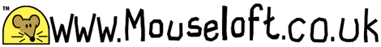

# Mouseloft

|

|
 | 

 |  | 

Mouseloft Cross Stitch Website

> © all product designs and Mouseloft trademarks on this website Copyright Roger Hart and Helen Hart, 1995 to present.

- [Mouseloft](https://www.mouseloft.co.uk/)

See the [site](https://alexhedley.github.io/mouseloft/)
